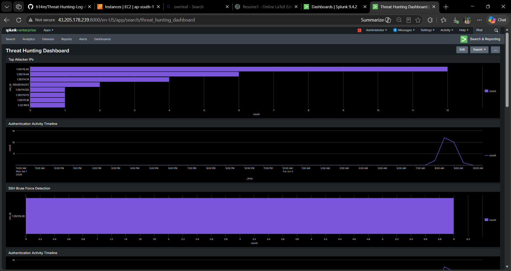
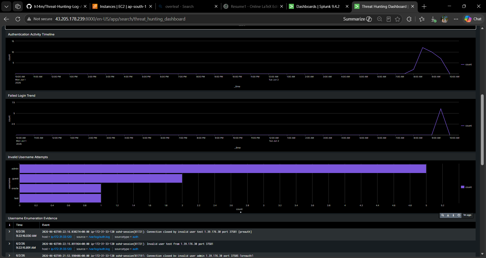
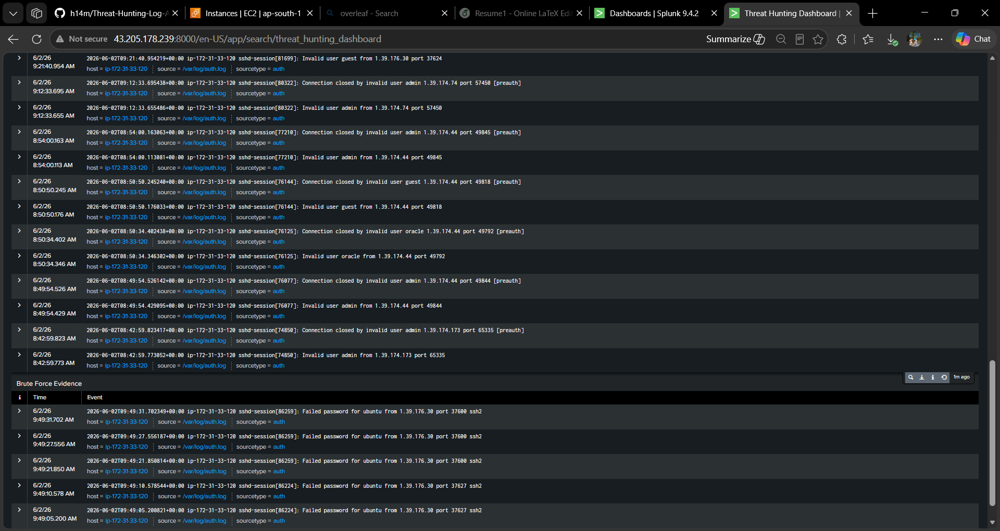
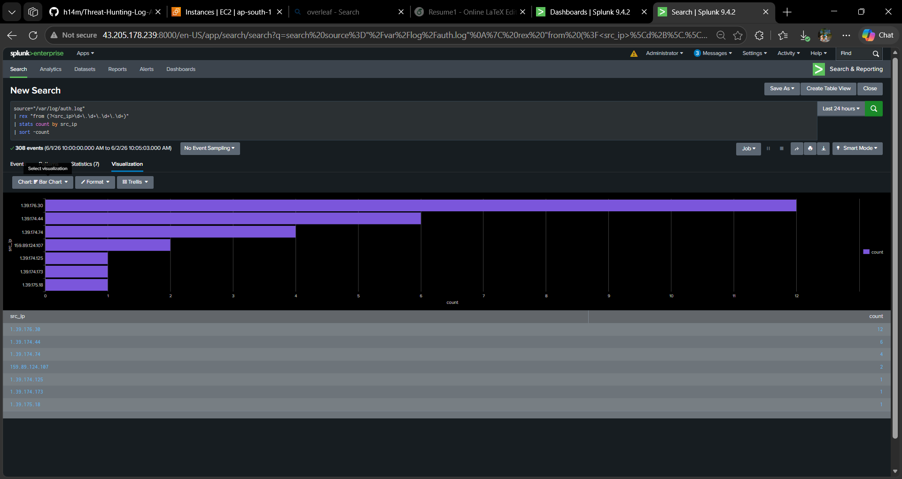
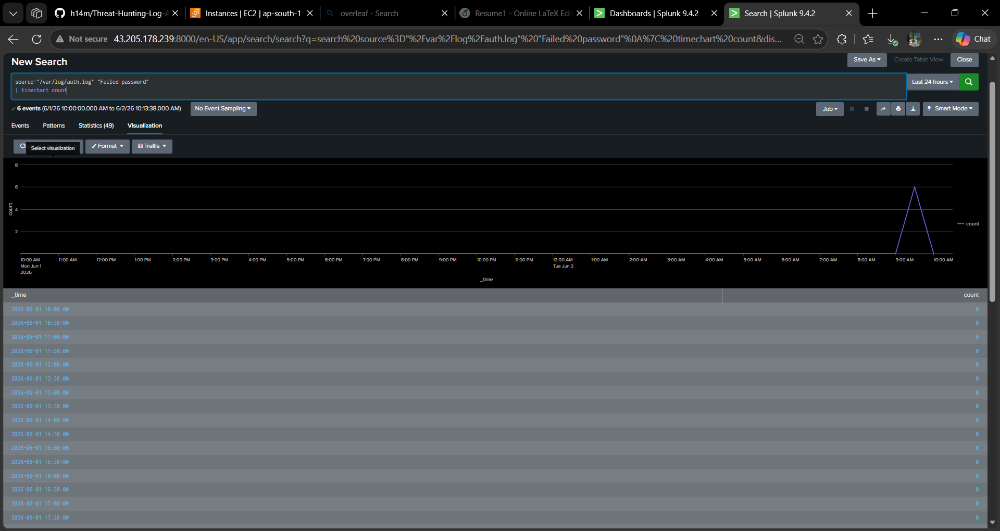
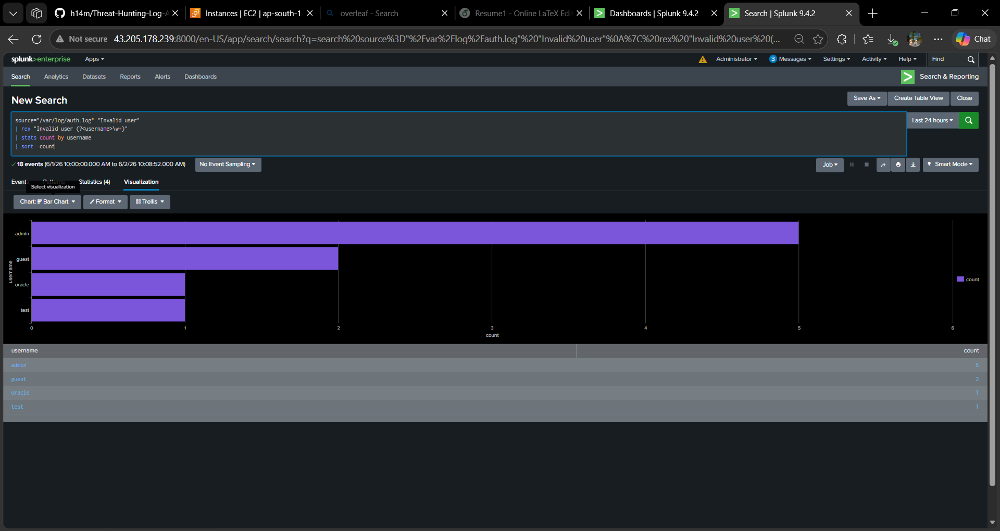
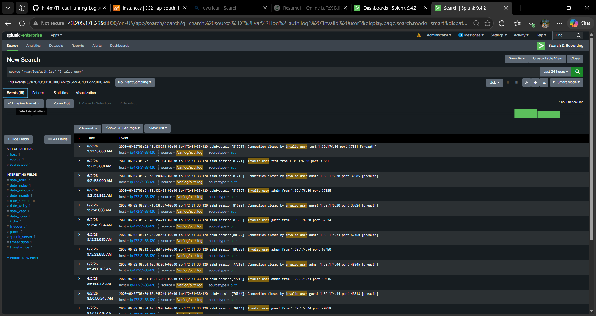
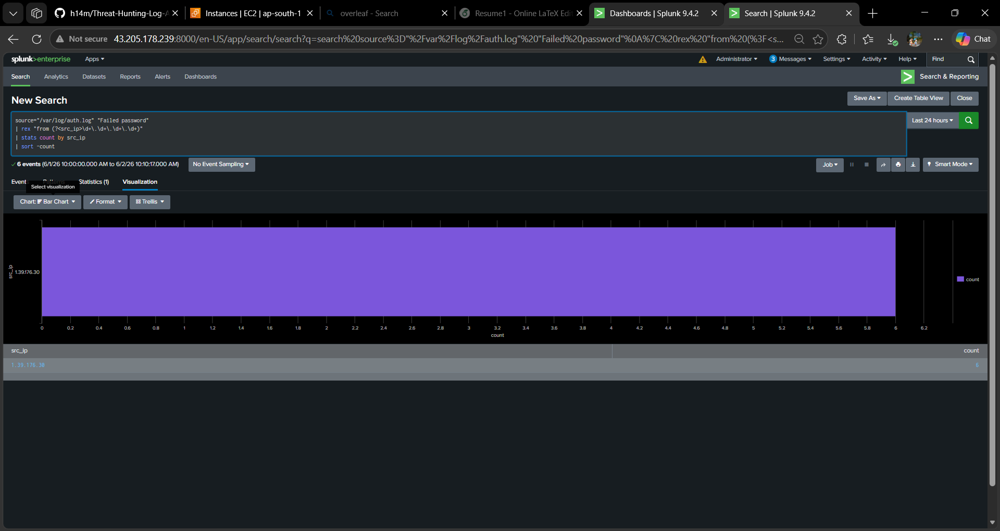
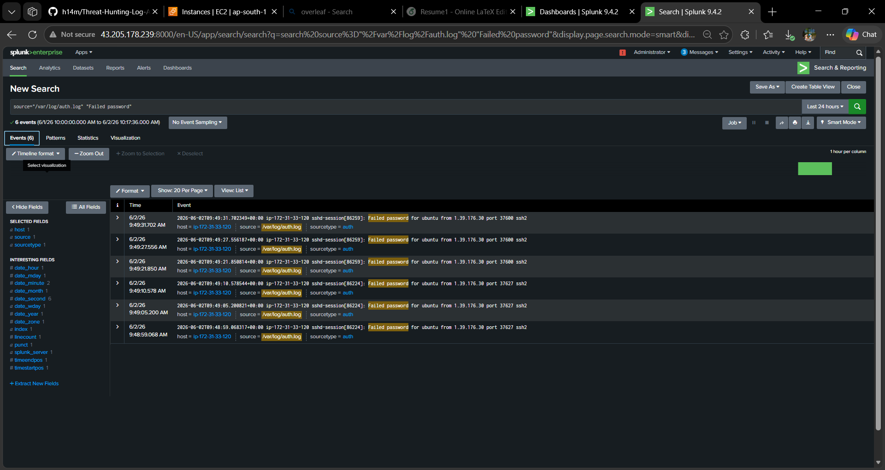
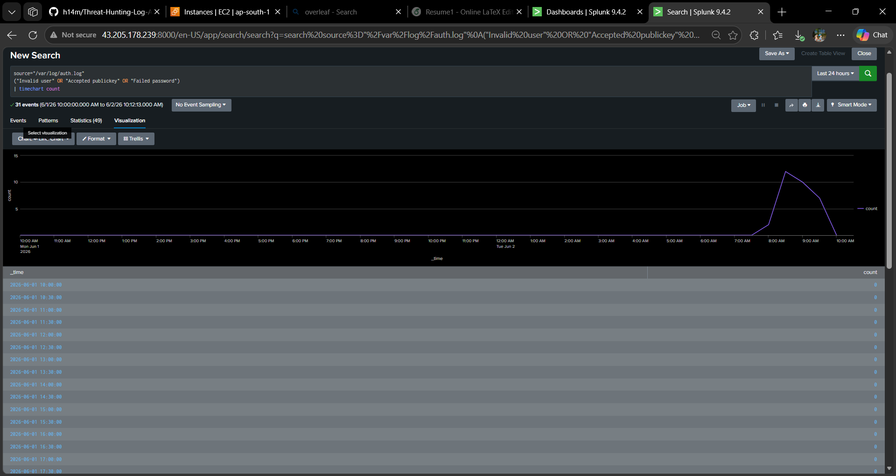

## Architecture


## Detection Content

- Splunk Detection Queries
- MITRE ATT&CK Mapping
- Incident Response Report
- Threat Hunting Dashboards


# Threat-Hunting-Log-Analysis-Platform
SOC-focused Threat Hunting and Log Analysis Platform using Splunk Enterprise, AWS EC2 Ubuntu, and Kali Linux for attack simulation, IOC analysis, incident investigation, and security monitoring.

## Overview

This project simulates a Security Operations Center (SOC) environment for threat hunting and log analysis.

The platform monitors Linux authentication logs collected from an AWS EC2 Ubuntu server and analyzes them using Splunk Enterprise. Attack activity is generated from Kali Linux to simulate real-world adversarial behavior.

The objective is to detect unauthorized access attempts, identify Indicators of Compromise (IOCs), investigate suspicious activity, and create actionable security alerts and dashboards.

## Architecture

```text
Kali Linux (Attacker)
        │
        ▼
AWS EC2 Ubuntu Server
        │
        ▼
Linux Authentication Logs (/var/log/auth.log)
        │
        ▼
Splunk Enterprise SIEM
        │
        ▼
Threat Detection & Investigation
        │
        ▼
Dashboards, Alerts & Incident Analysis
```
## Technologies Used

- Splunk Enterprise
- AWS EC2 Ubuntu Server
- Kali Linux
- Linux Authentication Logs
- SSH
- SPL (Search Processing Language)
- Git & GitHub

## Attack Simulation

The following attack scenarios were simulated:

- SSH Brute Force Attempts
- Invalid Username Enumeration
- Repeated Authentication Failures
- Unauthorized Login Attempts
- External IP Reconnaissance Activity

Attack traffic was generated from Kali Linux against the Ubuntu server to produce realistic authentication logs for investigation.

## Security Dashboards

The platform includes:

- SOC Monitoring Dashboard
- Threat Hunting Dashboard
- Security Analytics Dashboard
- Top Attacker IP Analysis
- Failed Login Trend Analysis
- Username Enumeration Detection
- Authentication Timeline Monitoring

## Alerting

A Splunk alert was configured to identify SSH brute force activity.

Trigger Condition:
- Failed authentication events detected

Severity:
- High

Action:
- Generate security alert for investigation

## Skills Demonstrated

- Security Monitoring
- Threat Hunting
- Log Analysis
- SIEM Operations
- Incident Investigation
- SSH Attack Detection
- Splunk SPL Development
- Dashboard Creation
- IOC Analysis
- AWS Security Monitoring
## Screenshots

### SOC Monitoring Dashboard


### Threat Hunting Dashboard


### Security Analytics Dashboard


### Top Attacker IP Addresses


### Failed Login Trend Analysis


### Invalid Username Attempts


### Username Enumeration Evidence


### SSH Brute Force Detection


### Brute Force Investigation Evidence


### Authentication Activity Timeline

